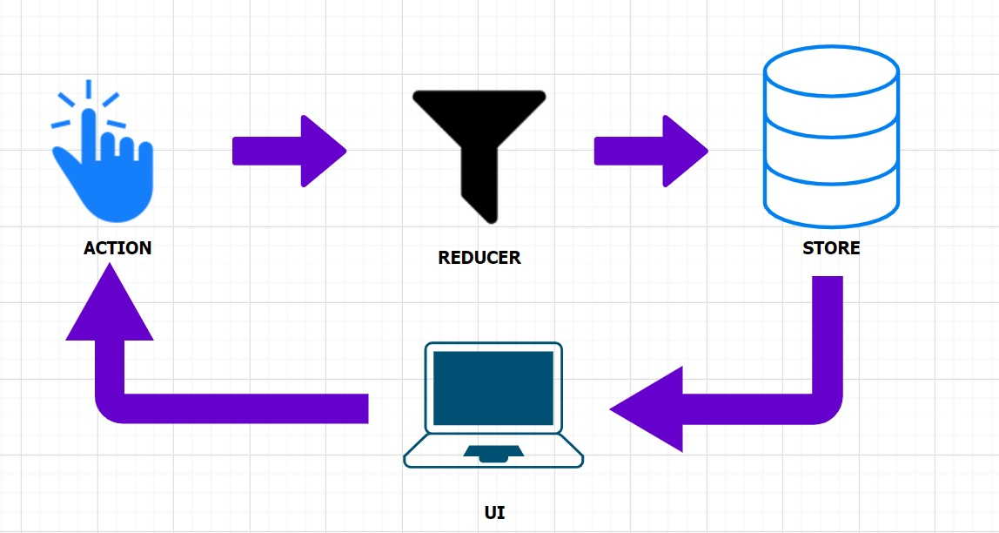

# lwc-redux
 Highly opinionated Redux state container implementaion for Lightning Web Components

This package is highly opinionated implementation of Redux which is a predictable state container for JavaScript apps, with LWC and basically a wrapper around the Redux libraries alongside a few middlewares that a you might need. It helps you write applications that behave consistently. 

# Motivation

As the requirements for LWC single-page applications have become increasingly complicated, our code must manage more events than ever before. UI events are also increasing in complexity, as we need to manage active routes, selected tabs, spinners, pagination controls, and so on.

Managing this ever-changing situation is hard. If a component can update another component,  which updates another component, and this, in turn, might cause another component to update. At some point, you no longer understand what happens in your app as you have lost control over the when, why, and how of its events. When a system is opaque and non-deterministic, it's hard to reproduce bugs or add new features.

There's only a percentage of reusability which can be achieved when going with lwc, which requires the components to be loosely coupled through events. But what if we could create loosely coupled & abstract application modules that don't use event and yet can be re-used, this opens a path for us to create manageable and reusable bundle of Lightning Web Components.

Frameworks like LWC and LockerService attempt to solve this problem in the view layer by removing direct DOM manipulation. However, managing the state of your data is left up to you. This is where lwc-redux enters.

# Three Principles of Redux

- ##### Single source of truth -
    - App Data is Centralized in Stores as a defined Data-Structure.
    - i.e. global state of your application is stored in an object tree within a single store.

- ##### State is read-only  
    - App Data cannot be directly modified.
    - The only way to change the state is to emit an action, an object describing what happened.

- ##### Changes are made with pure functions
    - To specify how the state tree is transformed by actions, you write pure reducers which are, on a basic level, functions.

lwc-redux works without any conflicts with Lightning Web Components Framework in your Lightning Experience and is also not affected by LockerService.

Here are some intuitive images that might click you:

